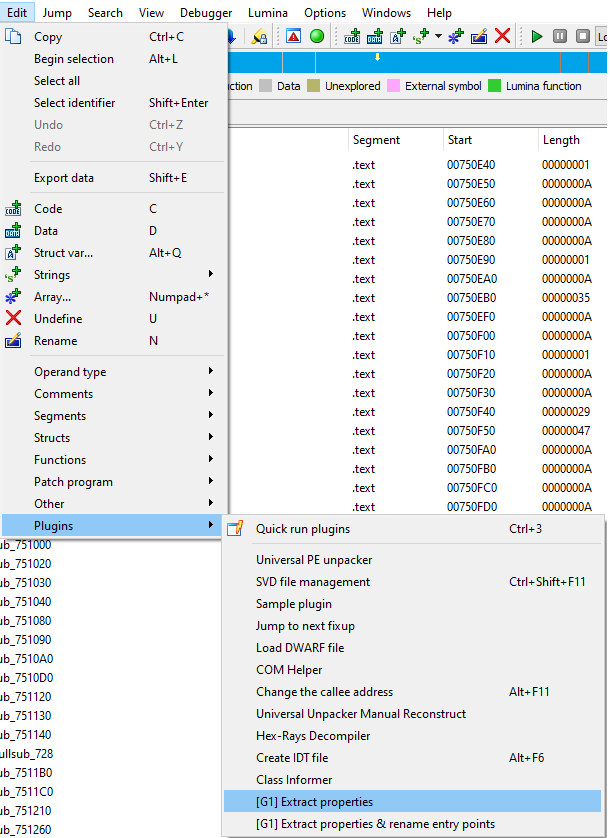

Glacier properties extractor
============================

About
------

This IDA Pro plugin helps to extract RTTI properties of classes in Glacier 1 engine.

```
This code is presented AS-IS. Please, make IDA snapshots or/and backups before using this code.
```

[](https://opensource.org/licenses/MIT)

Requirements
------------

 1. Use this extractor from base class to top class
 2. IDA Pro 7.x (tested on 7.6)
 3. Python 2.7.18 x86 (**not x64!**)

Usage
------

Load plugin via "File > Script file" (make sure that IDAPython is enabled)

Then you need to rename your getter method to ClassName::**GetProperties** like this


Then put cursor to mov instruction and run properties extractor via "Edit > Plugins > [G1 Extract properties]"



and the result will be in IDA console


You may use [JSONLint](https://jsonlint.com) service to read this data

Also, this plugin re-marks all collected information into your IDA DB (only in the `Extract properties & rename entry points` option)


Options
-------

 * [G1] Extract properties - just iterate over properties table and save data to JSON
 * [G1] Extract properties & rename entry points - extract properties and property entry points if we can
 